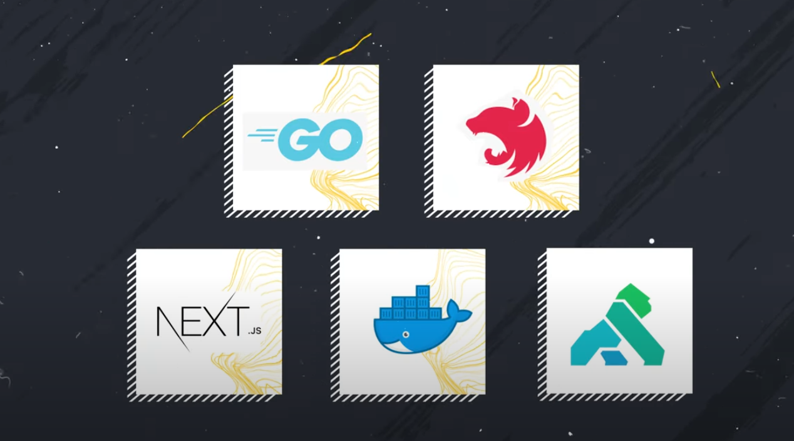

# Imersão FullCycle - DevTicket

### Principais tecnologias utilizadas no projeto

## Desafios

[Desafio-1](/partners-api/README.md)
[Desafio-2](/sales-api/README.md)

## Passos para o rodar o projeto localmente:

### Requisitos

- Docker

### Comandos

- terminal 1:

  - docker compose up

- terminal 2:

  - make go
  - make mysql-port

- terminal 3:

  - make npm-nestjs
  - make nestjs p=partner1

- terminal 4:

  - make nestjs p=partner2

- terminal 5:

  - rename front-nextjs/.env.example to front-nextjs/.env 
  - add GOLANG_API_TOKEN value generated by Kong
  - make npm-nextjs
  - make nextjs
